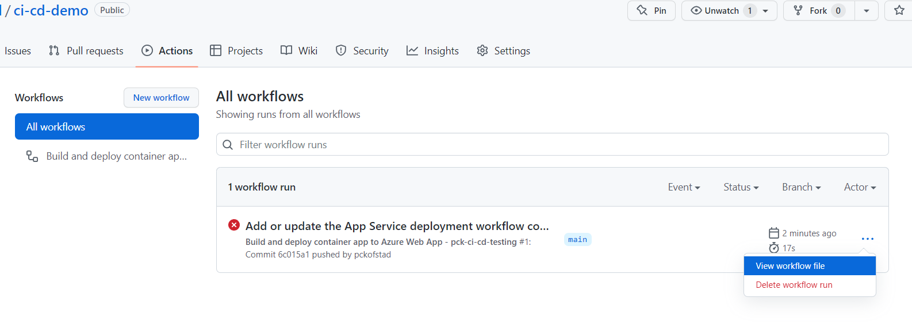

# CI/CD Demo
Resources for running a CI/CD setup demo against Azure


# 0. Setup a project to test and deploly

## 1. Create a github repo where you have ownership
To make it fast and easy, also create a readme file. This makes it easy to validate that you have initiated and cloed correctly. 

## 2. Clone down repo to your local machine
    c:\repo\ci-cd-demo

## 3. Create project to deploy
A simple project of any kind would do. We are going to use docker to build the project. A template might make it go faster. 


## 4. Run and test the app locally
If you are using the template, run the server to check that it is working. 

## 5. Add docker support to the project
- Right click on the BlazorApp1.Server in the solution and look in the Add submenu.
- Click: Add docker support
- Select linux container type

- Ensure docker desktop is running before testing the the docker file locally
- Testing can be done by selecting docker in the run-dropdown-menu


## 6. Commit existing code and push
.gitignore file is not created. Run the following command in the project folder:   

```
   dotnet new gitignore
```

# 1. Setup resources in Azure 

## 7. Create Azure docker registry
- Create new Container Registry
- Create new resource group, to make it easy to do cleanup later. Call it: CI-CD-testing
- Create a unique name for your registry. Lower caps, only letters. 
- SKU standard is fine
- Create registry

## 8. Configure docker registry
- Open Container registry
- Click on Identity
- Set System assigned identity to On
- Click Save
- Click Azure Role Assignment
- Click Add Role Assignment
- Select Scope: Resource Group
- Select Subscription (your selected subscription)
- Select Resource group: CI-CD-testing
- Role: AcrPull
- Click Save

- Click Access keys
- Enable Admin user
- Note down username and password


## 9. Create Azure App Service for testing
- Create Azure App service s
- Select the same resource group as for the docker-registry: CI-CD-testing (just to make it easy to clean-up)
- Define a unique name for your app1
- Select Docker container
- Select Linux
- Select a region close to you
- Create a new App Service Plan
- Change the SKU and Size (unless you want to test the existing size.)
    I will select B1 for the demo
- Click Next: Docker

- Select Options: Single Container
- Select Image Source: Quickstart


## 10. Configure Azure App Service
- Open App Service

- Click Deployment Center
- Click Source: GitHub Actions
    - You might need to log in
- Select the GitHub organisation where you have your repo
- Select the repo that you want to deploy
- Select the branch you want to deploy from

- Select Registry Source: Azure Container Registry
- Select Managed Identity
- Select Identity System Assigned
- Select your newly created Registry
- Under Image, give the docker image a suitable name and then : latest. All lower caps, no special characters. Like: mydemoapp:latest
- Click Save at the top of the page


# 3. Test and configure GitHub action

## 11. Configure GitHub action 
- Open the created yaml file template



- Find the secret variable names starting with "AzureAppService_ContainerUsername_" and "AzureAppService_ContainerPassword_"
- Note down the variable names

- Click on Settings in the repo menu
- Click Secrets and Actions
- You should see a repository secret that has a name starting with "AZUREAPPSERVICE_PUBLISHPROFILE_" allready. 
- Click add New Repository secret. 
- Add the variable name starting with "AzureAppService_ContainerUsername_" with the azure registry user name as the value. 
- Repeate the above for the "AzureAppService_ContainerPassword_" and registry Access key


## 12. Edit the yaml file to force the selected commit
- Click edit this file in the Yml file view. 
- Under the section "Build and push container image to registry" in the file. 
- Update the path to the DockerFile to match where it is in the repo. For me it is from: 

```
    file: ./Dockerfile
```

to

```
    file: ./BlazorApp1/Server/Dockerfile
```
- Click start commit. Either commit direcly or create a pull-prequest from a new branch. If you select pull-request then merge the pull-request inn straight away. 

## 12. Test your build pipeline
- Click on Actions in the repoitory menu
- Click on the menu Item with a name that starts with "Build and deploy container app to Azure Web App - "
- Click Run workflow
- If all is configured correctly everything should build and deploy without any errors. 

# Testing and self study
Can you test and figure out the following task on your own?

A. Do changes to the application, deploy them and see if it actually updates. Do you have to do something extra? If so, then what?

B. Clean up the variables in the yml file. Make the shorter and more readable. It is not possible to see the values in the secret variables from github, you need to retrieve this from Azure again. 

C. Do you dare to add some tests and make them run in the yml script? What strategy would you use?


